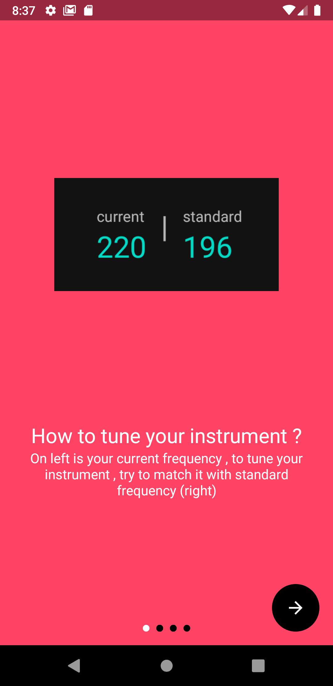
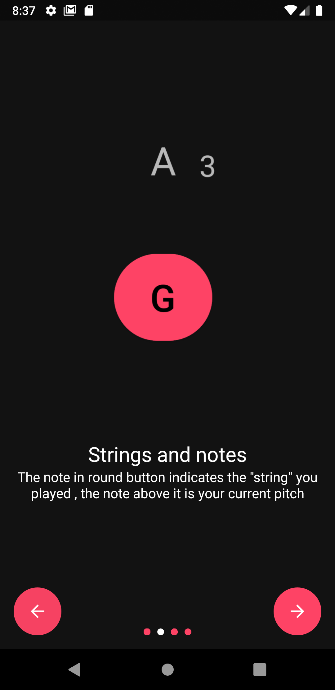
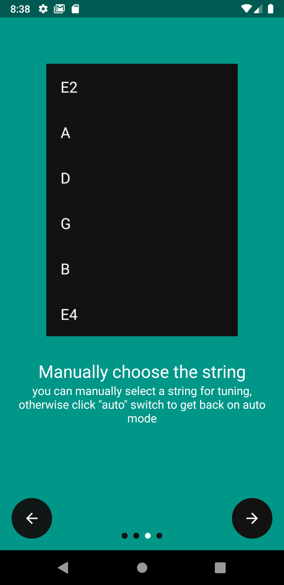
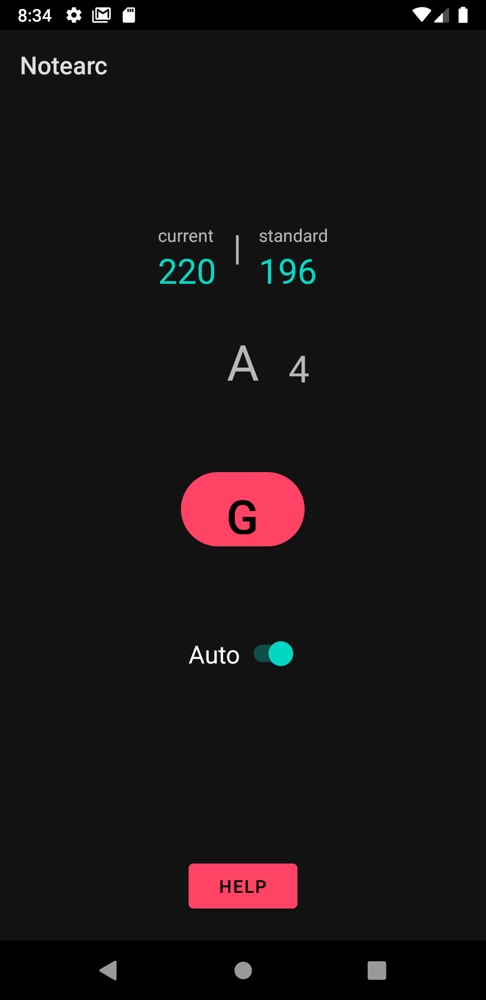

# NoteArc
#### A minimalistic guitar tuner and pitch detector

this project is my first android app and the submission for cs50 2020.
thank you david and tommy !

created using 
 - [TarsosDsp](https://github.com/JorenSix/TarsosDSP) (TarsosDSP is a Java library for audio processing)  .
 - [material.io](material.io) for theming 
 - [material-intro-screen](https://github.com/TangoAgency/material-intro-screen) for intro sequence.
# Functionality
 - Tune standard 6 string guitar (E A D G B E).
 - Note detection , so that you can do other tunings aswell.
 - frequency detection , using which tuning can be more accurate.
 - minimalistic simple ui . 
 
     
# working
   
Let's start with some really basic introduction to music theory and guitars. But at first we have to define some important musical terms as an exact distinction will avoid some ambiguities:

1. The  **frequency**  is defined as the reciprocal of the period duration of an repeating event. For example, if we have a sinusoidal signal with a period length of 2ms, the frequency is 500Hz.

2. **Pitch**  is the perceived frequency of a sound. Thus, in contrast to frequency which is physical measure, the pitch is a psychoacoustical measure. This distinction is needed as there are cases where we hear frequencies which are physically not there (or don't hear frequencies which are actually there).

3.  A  **note**  is just a pitch with a name. For example, the well known A4  is a pitch at 440Hz. It can also carry temporal information like whole notes or half notes, but this is rather uninteresting for us.

let take a look at guitar and how it works.

I guess most of you know this but the "default" guitar has 6 strings which are usually tuned in the standard tuning _EADGBE_. Whereby each note refers to one of the strings.

now , guitar has raised bars over fretboard called as FRETS.
the distance between 2 frets is called as a HALF STEP.

_fn  = f0  * (2)i/2_

i- number of half steps between these two frequencies
fn - current frequency
f0 - standard frequecy
now we use this formula to calculate HALF steps (i) from standard frequency f0.

for more info :-
https://pages.mtu.edu/~suits/NoteFreqCalcs.html
https://en.wikipedia.org/wiki/Equal_temperament  

if we try to get i on one side , we get 

12⋅log2(fn/fo) = i

# implementation 
### 1 . 
Now we take audio from mic and process it to find the fundamental frequency.
before that , lets look at fundamental frequencies and algorithms to find it.

as you can see , an instrument produces multiple frequecies even tho there is silence .
to find the fundamental frequecie , you need [pitch detecting algorithms](https://en.wikipedia.org/wiki/Pitch_detection_algorithm#:~:text=A%20pitch%20detection%20algorithm%20(PDA,the%20frequency%20domain%2C%20or%20both.) )

we will be using FFT_YIN , which is already provided in TarsosDsp library i mentioned before.

#### 2 . 
now we got the fundamental frequency , now we can use the formula i mentioned before to calculate the half steps .

using half steps , we can simple find the note and ocatave as we already know the standard frequency or the standard note

here, 440hz  , A4 note is the standard frequency . we can count the number of steps from there to find the current note.

[click to learn more](https://www.justinguitar.com/guitar-lessons/the-note-circle-mt-101)

#### 3 .
now just match you current frequency to standard one to tune ;)
